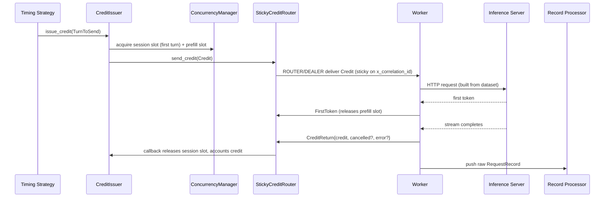
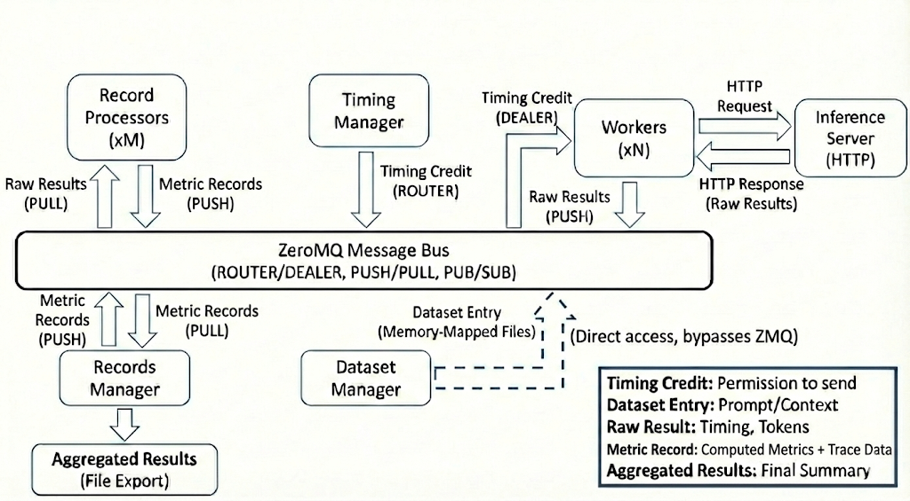

# Architecture of AIPerf

AIPerf is a distributed benchmarking tool for measuring AI inference performance. It generates load against inference endpoints, collects detailed performance metrics, and provides comprehensive analysis of throughput, latency, and resource utilization.

## Architecture Overview

AIPerf is designed as a modular, extensible benchmarking framework that separates concerns across three architectural planes. The system scales horizontally as more workers are added while maintaining centralized orchestration.

### Three-Plane Architecture

| Plane | Components | Purpose |
|-------|-----------|---------|
| **Control Plane** | SystemController, Timing Manager, Dataset Manager, Worker Manager | Decides what, when, and how many requests to send |
| **Data Plane** | Workers, Inference Server | Executes the actual I/O and request/response cycle |
| **Analytic Plane** | Record Processors, Records Manager, GPU Telemetry Manager, Server Metrics Manager | Computes metrics and collects telemetry |

### Request Lifecycle

1. **Initialization**: Dataset Manager loads data, Timing Manager prepares schedule
2. **Warmup** (optional): Workers send warmup requests to prime JIT, caches, and connection pools. Results are discarded.
3. **Profiling**: Workers receive credits, access data, send requests to inference server
4. **Collection**: Workers capture response timing and content
5. **Processing**: Record Processors compute metrics in parallel
6. **Aggregation**: Records Manager collects and exports results

## Core Components

### System Controller

The System Controller is the central orchestrator that manages the lifecycle and coordination of all major modules involved in a benchmarking run.

**Key Responsibilities:**
- Registering and initializing core components
- Orchestrating the start, execution, and shutdown of benchmarking tasks
- Handling configuration, resource allocation, and inter-module communication
- Monitoring the overall progress and health of the benchmarking process
- Managing error handling, cleanup, and graceful termination of all modules

### Dataset Manager

The Dataset Manager handles all aspects of input data management during benchmarking runs.

**Key Responsibilities:**
- Loading datasets from various sources (JSONL, CSV, synthetic generators, trace replay formats)
- Parsing and validating input data to ensure it matches the expected format
- Writing dataset to memory-mapped files, enabling workers to access data directly without message passing
- Supporting custom dataset types, including conversation-replay traces (Mooncake-format JSONL, Weka agentic-coding traces, Bailian, BurstGPT, DAG JSONL), for advanced benchmarking scenarios
- Managing the lifecycle of datasets, including initialization, iteration, and cleanup

### Timing Manager

The Timing Manager controls and coordinates the timing of requests during benchmarking runs through a credit-based system.

**Key Responsibilities:**
- Scheduling when each request should be sent based on the selected timing mode (fixed schedule, request-rate, user-centric rate, or agentic replay)
- Managing precise timing to accurately reproduce real-world or synthetic load patterns
- Supporting advanced timing scenarios, such as replaying traces with specific inter-arrival times or simulating bursty traffic
- Ensuring that requests are dispatched to workers at the correct intervals for reliable measurement

### Worker Manager

The Worker Manager orchestrates and manages the pool of worker processes that execute benchmarking tasks.

**Key Responsibilities:**
- Coordinating with the system controller to spawn and shut down workers that send requests to the inference server
- Monitoring worker status, progress, and resource usage
- Handling worker lifecycle events, such as startup, shutdown, and error recovery
- Managing worker pool size based on benchmarking requirements

### Workers

Workers are the processes that send HTTP requests to the inference server and measure response times.

**Key Responsibilities:**
- Send HTTP requests to inference servers and measure response timing
- Wait for timing credits before sending requests (enables precise load control)
- Track conversation state for multi-turn interactions
- Report timing measurements to Record Processors for analysis

**Scalability:**
- Run multiple workers (e.g., 10, 50, 100+) to support different workload patterns
- No coordination between workers
- Adding more workers increases load capacity and request rates

### Record Processor

The Record Processor processes and interprets the responses received from the inference server during benchmarking.

**Key Responsibilities:**
- Parsing raw inference results to extract relevant metrics (latency, output tokens, correctness)
- Handling different response formats from various model endpoints (OpenAI, vLLM, Triton, custom APIs)
- Validating and normalizing results to ensure consistency across benchmarking runs
- Computing metrics derived from individual requests (TTFT, ITL, Request Latency, Request Throughput etc.)
- Supporting error detection and handling for malformed or unexpected responses
- Scales horizontally to handle high-volume metric computation

### Records Manager

The Records Manager handles the collection, organization, and storage of benchmarking records and results.

**Key Responsibilities:**
- Aggregating data from the records processors (inference results, timing information, metrics)
- Storing records in memory and/or exporting them to files (CSV, JSON, Parquet) for later analysis
- Providing interfaces for querying, filtering, and summarizing benchmarking results
- Supporting the generation of reports and artifacts for performance evaluation
- Managing the final export of aggregated performance summaries and per-request details

### GPU Telemetry Manager

The GPU Telemetry Manager collects GPU metrics during benchmarking runs via pluggable collectors.

**Key Responsibilities:**
- Collecting GPU metrics (power, utilization, memory, temperature, errors) via two collector backends:
  - **DCGM**: Scrapes DCGM Exporter HTTP endpoints (Prometheus format)
  - **PyNVML**: Queries NVIDIA GPUs directly via the pynvml Python library (no external endpoint required)
- Auto-discovering DCGM endpoints
- Supporting custom endpoints via `--gpu-telemetry` flag
- Exporting GPU telemetry alongside benchmark results

### Server Metrics Manager

The Server Metrics Manager collects metrics from Prometheus-compatible endpoints during benchmarking runs.

**Key Responsibilities:**
- Collecting metrics from Prometheus-compatible endpoints (inference server application metrics, system metrics, custom metrics)
- Auto-discovering metrics endpoints from configured inference server URLs (`--url`)
- Supporting custom Prometheus endpoints via `--server-metrics` flag
- Parsing any metrics exposed in Prometheus format (gauges, counters, histograms)
- Typical metrics collected: inference server KV cache usage, request counts, latencies, batch sizes, model-specific metrics, and server resource metrics
- Auto-detecting non-Prometheus endpoints (e.g. TRT-LLM serves an iteration-stats JSON array at `/metrics` by default), probing `<base>/prometheus/metrics` once as a fallback, and disabling collection for that endpoint after a single warning if neither path yields parseable Prometheus data — see [Server Metrics Compatibility & auto-disable](server-metrics/server-metrics.md#compatibility--auto-disable)
- Exporting server metrics alongside benchmark results

## How AIPerf Works

### Credit System & Request Timing

A **credit** is AIPerf's core scheduling primitive: a single token that authorizes one worker to dispatch exactly one request to the inference server. Credits are how the control plane (Timing Manager) decides *when* a request goes out, while staying decoupled from the data plane (Workers) that actually performs the I/O. Nothing else gates a request — if a worker holds a credit, it sends; if it does not, it waits.

#### What a Credit Carries

The over-the-wire credit is the `Credit` msgspec struct in `src/aiperf/credit/structs.py`. Each credit binds together:

- **Identity**: a sequential `id`, the `phase` it belongs to (`CreditPhase.WARMUP` or `CreditPhase.PROFILING`), and the `issued_at_ns` wall-clock timestamp.
- **What to send**: a `conversation_id` (template ID in the dataset) plus `turn_index` / `num_turns` so the worker knows *which turn of which conversation* this credit pays for. The worker reads the actual prompt text from the memory-mapped dataset using these keys — payloads are never on the credit itself.
- **Where to route**: an `x_correlation_id` (conversation instance ID) used by the `StickyCreditRouter` to pin all turns of one conversation to the same worker for KV-cache locality. DAG sub-agents additionally carry `parent_correlation_id`, `agent_depth`, `has_forks`, `branch_mode`, and `root_correlation_id` (the depth-0 root's id, shared by every node of a session **tree** — see [Session-tree concurrency](#session-tree-concurrency-agentic-replay)).
- **Optional shaping**: `cancel_after_ns` (for simulated client disconnects), `url_index` (multi-URL load balancing), `cache_bust_marker` / `cache_bust_target` (prefix-cache busting).

A credit is therefore *one request worth of intent*, not a whole multi-turn conversation. A 5-turn conversation is 5 credits; a parent turn that forks 3 children produces 1 + 3 credits.

#### Lifecycle

The exact symbols: `CreditIssuer.issue_credit` in `src/aiperf/credit/issuer.py` acquires slots from `ConcurrencyManager` and hands the `Credit` to `StickyCreditRouter.send_credit` (`src/aiperf/credit/sticky_router.py`). The worker handles arrival in `Worker._schedule_credit_drop_task` (`src/aiperf/workers/worker.py`), wraps the credit in a `CreditContext`, dispatches the HTTP request, and — in a `finally` block — emits a `CreditReturn` (`src/aiperf/credit/messages.py`) so the slot is *always* released even on cancel/error. `FirstToken` is a separate event that releases just the prefill slot at TTFT, before the response stream finishes.

#### Issuance Modes

The `CreditIssuer` is timing-mode agnostic; the strategy in `src/aiperf/timing/strategies/` decides *when* to call `issue_credit`:

- **Fixed schedule** (`fixed_schedule.py`): replay trace timestamps from dataset metadata.
- **Request-rate** (`request_rate.py`): issue at a target rate with constant / Poisson / gamma / concurrency-burst arrival patterns.
- **User-centric rate** (`user_centric_rate.py`): each session is an independent user; turn gaps come from the trace.
- **Agentic replay** (`agentic_replay.py`): scenario-driven DAG replay. Weka loaders persist interval-order predecessor frontiers derived from `[t, t + api_time]`; `ReplayBarrierCoordinator` enforces their fan-out/join barriers, while `BranchOrchestrator` starts branches from the parent send when their recorded intervals overlap and otherwise uses the normal completion path.

#### Relationship to `--request-count`, `--num-conversations`, Concurrency

- `--num-conversations N` caps the **number of distinct conversation instances** that ever start (via the session slot, acquired only on first-turn credits). Each conversation still issues one credit per turn.
- `--request-count N` caps **total credits issued in the profile phase**, recycling the dataset to refill idle session slots while long traces sit in `delay_ms` waits — see the gotcha in `docs/benchmark-modes/`.
- `--concurrency N` sizes the **session slot pool** — the maximum number of sessions live at once; the issuer blocks on `acquire_session_slot` when full, providing natural backpressure. For agentic replay each session slot is a whole session **tree** (root + all its subagents), held until the entire tree drains (see [Session-tree concurrency](#session-tree-concurrency-agentic-replay)). (`--prefill-concurrency` separately bounds requests in the prefill stage.)

#### Why This Design

Credits are deliberately a single, immutable, self-describing struct sent over a ROUTER/DEALER socket. There is no shared mutable state between Timing Manager and Workers — the credit *is* the state. This buys three things: workers can scale horizontally with no coordination protocol; backpressure is automatic (slots saturate, issuance stalls, the server is never piled on); and post-hoc accounting is exact because every credit produces exactly one `CreditReturn`, even on failure paths.

### Data Flow & Messaging

This section describes the end-to-end message flow during a benchmark run, showing how data moves between components through the ZMQ message bus.

**Key Data Structures:**
- **Timing Credit**: Grants permission to send one request
- **Dataset Entry**: Prompt and conversation context
- **Raw Result**: Request timing, tokens, response text
- **Metric Record**: Per-request computed metrics plus trace data
- **Aggregated Results**: Final performance summary and per-request details

**Message Flow:**
1. Credit Router routes credits to workers via ROUTER/DEALER pattern
2. Workers access dataset entries via memory-mapped files
3. Workers send requests to Inference Server (external HTTP)
4. Workers push raw results to Record Processors
5. Record Processors push metric records to Records Manager
6. Records Manager aggregates and exports final results

### Sub-Agents (Conversation Forking)

AIPerf supports **conversation forking** as a first-class primitive: a parent turn may declare one or more `forks` (FORK mode, sticky-routed for prefix-cache locality) or `spawns` (SPAWN mode, routed freely). When the parent turn completes, child sessions are created and dispatched concurrently. FORK children are seeded with a clone of the parent's accumulated message history so the server sees prefix reuse; SPAWN children start with empty history. This enables benchmarks where one turn's response feeds multiple parallel continuations that share a prefix on the server — the shape required by prefix-cache and KV-aware-routing studies.

The `BranchOrchestrator` lives in `src/aiperf/timing/branch_orchestrator.py`, alongside `ConversationSource` (in `conversation_source.py`) and the timing strategies, and is wired into `src/aiperf/credit/callback_handler.py`, invoked before the strategy's `handle_credit_return` call. When `orchestrator.intercept(credit)` returns `True`, the credit is consumed for a branch burst rather than the strategy's default next-turn dispatch. Children never acquire a session slot of their own (`CreditIssuer` sets `needs_session_slot = is_session_start and not is_child`); they inherit the root's slot and are tracked by the orchestrator's per-parent join/descendant bookkeeping.

FORK-mode sticky routing keys on `parent_correlation_id` so every descendant of a given root is sticky-routed to the **same worker** as the root, exposing Phase-1 prefix reuse and KV-aware routing on the server. SPAWN-mode children route freely.

Stats flow out of the Timing Manager via `CreditPhaseCompleteMessage` (carrying `BranchStats` counters: `children_spawned`, `children_completed`, `children_errored`, `parents_suspended`, `parents_resumed`). Existing per-request metrics are tagged with `agent_depth` so post-hoc analysis can distinguish root vs child load.

#### Session-tree concurrency (agentic replay)

In agentic replay a "session" is not a single root conversation — it is a whole **tree**: a depth-0 root plus every subagent it spawns, recursively (children, subchildren, background `::fa:` flat-async streams, `::aux:` sidecars). `--concurrency N` means N such trees live at any instant.

`SessionTreeRegistry` (`src/aiperf/timing/session_tree.py`) owns this. It holds **exactly one session slot per tree**, keyed by `root_correlation_id` — the depth-0 root's `x_correlation_id`, which every node of the tree inherits and which is persisted in `profile_export.jsonl`. The slot is released **once, when the whole tree drains**: the root has sent its terminal turn **and** every descendant has terminally completed. The physical slot is still acquired by `CreditIssuer`/`ConcurrencyManager` (so the session semaphore hard-caps occupancy at `--concurrency`); the registry only owns the *release* decision, and on release fires a drain callback so the freed lane recycles into a fresh root. This makes a background subagent that outlives its root keep the lane's slot — preventing a new root from starting early and pushing live trees above N. Lanes that begin with no dispatchable root (a *rootless* snapshot whose root is all before the sampled `t*`, or a *gated* parent waiting on a child join) hold the same per-tree slot via a lane credit. The registry is engaged for agentic-replay PROFILING only; other timing modes keep the per-root-credit release.

See:
- [DAG Benchmarking (Sub-Agents)](benchmark-modes/dag.md) — user-facing guide and example.

## Communication Architecture

AIPerf services communicate internally via a **ZeroMQ (ZMQ) message bus**, designed for low-latency, high-throughput message passing between components.

### Why ZMQ?

AIPerf uses ZMQ to maintain **measurement accuracy** by decoupling orchestration logic from execution:

- **Low-overhead messaging**: Credits are routed directly to workers
- **Asynchronous by design**: No blocking calls between services, ensuring workers spend maximum time on I/O and timing
- **Efficient transport**: ZMQ is designed for low-overhead inter-process communication
- **Scalability**: Supports distributed workers across multiple nodes without code changes

### Communication Patterns

AIPerf uses **ZMQ proxies** for message routing between services and workers:

- Services publish strongly-typed messages to specific topics (Pub/Sub pattern)
- Services subscribe to relevant message types
- Router/Dealer patterns for credit distribution to workers
- Request/Reply patterns for synchronous operations

### State Management

**Stateless design** for scalability:
- **Workers**: No shared state between workers; each maintains only local conversation context for multi-turn requests
- **Services**: All service state is ephemeral and can be reconstructed from configuration
- **Coordination**: Credit distribution happens through the message bus; dataset access via memory-mapped files
- **Results**: Only aggregated results are persistent (exported to files)

### Wire Format Compatibility

AIPerf uses Pydantic / msgspec models directly as ZMQ message payloads — there is **no wire-protocol version handshake**. All services in a single run must be built from the same source tree. Mixed-version clusters (e.g. an updated Worker talking to an older Records Manager) are not supported. A single deploy ships all services together; rolling upgrades require a clean drain of in-flight credits before cutting over.

Notably, the record-pipeline slim-down in the DAG sub-agents release changed several model shapes in a single commit:
- `RequestRecord.request_info` now carries a slim `RecordContext` instead of the full `RequestInfo` (worker-side dispatch fields stay on the worker)
- `RequestRecord.turns` removed (consumers read `payload_bytes` via the endpoint's `extract_payload_inputs` hook)
- `Credit`/`TurnToSend` gained `agent_depth`, `parent_correlation_id`, `has_forks`, `branch_mode` fields for DAG routing

Old clients receiving new messages (or vice versa) will fail to deserialise. If you need to upgrade a running benchmark, stop and restart the whole cluster.

## Design Principles

AIPerf is built on three core principles:
- **Separation of Concerns**: Control plane orchestrates, workers execute, record processors compute metrics
- **Scalability**: Horizontal scaling for workers and processors with credit-based flow control
- **Extensibility**: Plugin system for datasets, endpoints, transports, and metrics

## Deployment Modes

AIPerf supports distributed execution with two deployment models:

- **Multiprocess Mode**: Each service runs as a separate process on a single node (default for single-node deployments)
- **Kubernetes Mode**: Services and workers run as separate pods in a Kubernetes cluster (for multi-node deployments) *(not yet implemented)*

## External Dependencies

AIPerf integrates with external systems:

- **Inference Server**: The target system being benchmarked (vLLM, Dynamo, SGLang, etc.)
- **DCGM Exporter**: Optional GPU telemetry source (exposes GPU metrics in Prometheus format). Alternative: PyNVML queries GPUs directly without an external endpoint.
- **Prometheus-compatible endpoints**: Optional server/application metrics source for Server Metrics Manager (inference servers like vLLM expose metrics in Prometheus format at their /metrics endpoint)
